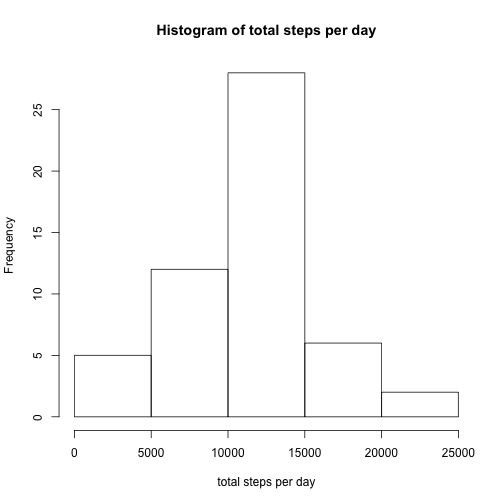
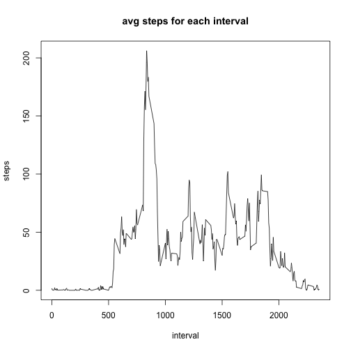
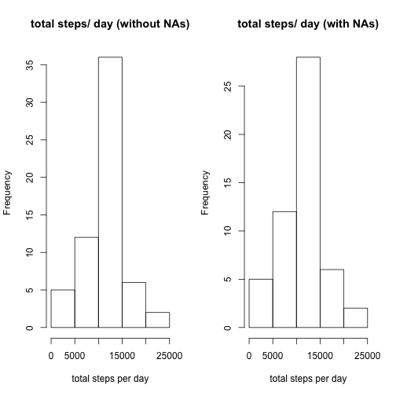
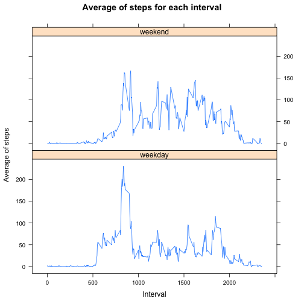

PA1 Assignment - Reproducable research
======================================

###PA1 - Question 1
This document explains and depicts the code used to load the activity data tracked.

The data is downloaded from the course website [here](https://d396qusza40orc.cloudfront.net/repdata%2Fdata%2Factivity.zip)

The file downloaded activity.csv is then copied into a folder called data/ in the working directory.

###Reading the csv  data.

```r
df <- read.csv("./data/activity.csv")
head(df)
```

```
##   steps       date interval
## 1    NA 2012-10-01        0
## 2    NA 2012-10-01        5
## 3    NA 2012-10-01       10
## 4    NA 2012-10-01       15
## 5    NA 2012-10-01       20
## 6    NA 2012-10-01       25
```

### Calculate the total number of steps taken per day ignoring the NAs.

```r
agg_df <- aggregate(steps~date, df, sum, na.rm=TRUE )
```
Now, plot the histogram for toal number of steps taken per day.

```r
hist(agg_df$steps,main="Histogram of total steps per day",xlab="total steps per day")
```

 


Mean of the total number of steps per day is 1.0766189 &times; 10<sup>4</sup> and median is 10765

```r
mean(agg_df$steps)
```

```
## [1] 10766.19
```

```r
median(agg_df$steps)
```

```
## [1] 10765
```

##PA1 - Question 2

Following code calculates the average number of steps for each time interval across all the days in the dataset.

```r
avg_df <- aggregate(steps~interval, df, mean, na.rm=TRUE )
```
Using the above data, a graph is plotted  with the avg number of steps on the y-axis and the intervals on the y-axis.


```r
plot(avg_df$interval, avg_df$steps, type="l",xlab="interval",ylab="steps",main="avg steps for each interval")
```

 

Calculate the interval that has maximum number of avg number of steps

```r
avg_df[avg_df$steps==max(avg_df$steps),1] 
```

```
## [1] 835
```

###PA1 - Question 3
In the first step, we shall claculate the number of rows that have an NA in the steps column:


```r
na_df <- df[is.na(df$steps),]
nrow(na_df)
```

```
## [1] 2304
```

Below process replaces the NA values in the data frame with the mean for the corresponding interval calclated in the earlier steps. In order to achieve this, we will use the sqldf function. With this function we can join the original dataframe(df) and the dataframe with the averages of steps for all intervals across the dates.

```r
require(sqldf)
require(dplyr)
require(lattice)

join_df <- sqldf("select * from df inner join avg_df where df.interval = avg_df.interval")
```

In the next step, the column names in the data frame are modified to remove the duplicate names and the one of the interval column is deleted.


```r
names(join_df) <- c("steps","date","interval","interval_del","steps_mean")
join_df$interval_del <- NULL
```

The resulting dataframe looks like this:


```r
head(join_df)
```

```
##   steps       date interval steps_mean
## 1    NA 2012-10-01        0  1.7169811
## 2    NA 2012-10-01        5  0.3396226
## 3    NA 2012-10-01       10  0.1320755
## 4    NA 2012-10-01       15  0.1509434
## 5    NA 2012-10-01       20  0.0754717
## 6    NA 2012-10-01       25  2.0943396
```

Now, the NAs are replaced with the corresponding means in the steps_mean column using the mutate function. However, this "replace" is applied only if the steps value is NA.


```r
join_df <- mutate(join_df,steps = ifelse(is.na(steps),steps_mean,steps))
```

The resulting dataset looks like this:


```r
head(join_df)
```

```
##       steps       date interval steps_mean
## 1 1.7169811 2012-10-01        0  1.7169811
## 2 0.3396226 2012-10-01        5  0.3396226
## 3 0.1320755 2012-10-01       10  0.1320755
## 4 0.1509434 2012-10-01       15  0.1509434
## 5 0.0754717 2012-10-01       20  0.0754717
## 6 2.0943396 2012-10-01       25  2.0943396
```
Calculating the sum of the steps per day using the new dataset. After the new dataset is created, we shall draw two histograms one based on the old datset with NAs and new dataset without NAs. That way we can compare both histograms.


```r
join_agg_df <- aggregate(steps~date, join_df, sum, na.rm=TRUE )
par(mfrow = c(1,2))
hist(join_agg_df$steps,main="total steps/ day (without NAs)",xlab="total steps per day")

hist(agg_df$steps,main="total steps/ day (with NAs)",xlab="total steps per day")
```

 

By looking at the above two graphs, we can conclude that the histograms doesn't differ much. Since we have considered the mean of the interval steps to impute the missing values, there isn't a big impact on the resulting.

Now, lets compare the means and medians:


```r
mean(join_agg_df$steps)
```

```
## [1] 10766.19
```

```r
median(join_agg_df$steps)
```

```
## [1] 10766.19
```

From the above values we can conclude that while mean remained same between the old and new datasets, the median is now equal to mean in the new dataset.

### PA1 - Question 4

Calculate the weekdays for the new dataset:


```r
join_df <- mutate(join_df, weekday = weekdays(as.Date(join_df$date,'%Y-%m-%d')))
```

Calculate the weekend indicator based on the weekdays calcuated in the previous step:

```r
join_df <- mutate(join_df, weekday_ind = ifelse(join_df$weekday=="Sunday" | join_df$weekday=="Saturday","weekend","weekday"))
```
The resulting dataset looks like this:


```r
head(join_df)
```

```
##       steps       date interval steps_mean weekday weekday_ind
## 1 1.7169811 2012-10-01        0  1.7169811  Monday     weekday
## 2 0.3396226 2012-10-01        5  0.3396226  Monday     weekday
## 3 0.1320755 2012-10-01       10  0.1320755  Monday     weekday
## 4 0.1509434 2012-10-01       15  0.1509434  Monday     weekday
## 5 0.0754717 2012-10-01       20  0.0754717  Monday     weekday
## 6 2.0943396 2012-10-01       25  2.0943396  Monday     weekday
```

Now, convert the newly calculated weekday_ind to a factor in the dataframe:


```r
join_df$weekday_ind <- as.factor(join_df$weekday_ind)

summary(join_df)
```

```
##      steps                date          interval        steps_mean     
##  Min.   :  0.00   2012-10-01:  288   Min.   :   0.0   Min.   :  0.000  
##  1st Qu.:  0.00   2012-10-02:  288   1st Qu.: 588.8   1st Qu.:  2.486  
##  Median :  0.00   2012-10-03:  288   Median :1177.5   Median : 34.113  
##  Mean   : 37.38   2012-10-04:  288   Mean   :1177.5   Mean   : 37.383  
##  3rd Qu.: 27.00   2012-10-05:  288   3rd Qu.:1766.2   3rd Qu.: 52.835  
##  Max.   :806.00   2012-10-06:  288   Max.   :2355.0   Max.   :206.170  
##                   (Other)   :15840                                     
##    weekday           weekday_ind   
##  Length:17568       weekday:12960  
##  Class :character   weekend: 4608  
##  Mode  :character                  
##                                    
##                                    
##                                    
## 
```

Now calculating the mean of the steps for each interval across weekday_ind.


```r
avg_join_df <- aggregate(join_df$steps,join_df[c("interval","weekday_ind")],mean )
head(avg_join_df)
```

```
##   interval weekday_ind          x
## 1        0     weekday 2.25115304
## 2        5     weekday 0.44528302
## 3       10     weekday 0.17316562
## 4       15     weekday 0.19790356
## 5       20     weekday 0.09895178
## 6       25     weekday 1.59035639
```

Now plotting the mean of steps for each interval across weekdays and weekends.


```r
xyplot(avg_join_df$x~avg_join_df$interval|avg_join_df$weekday_ind, type="l",layout=(c(1,2)),xlab="Interval", ylab="Average of steps",main="Average of steps for each interval")
```

 
